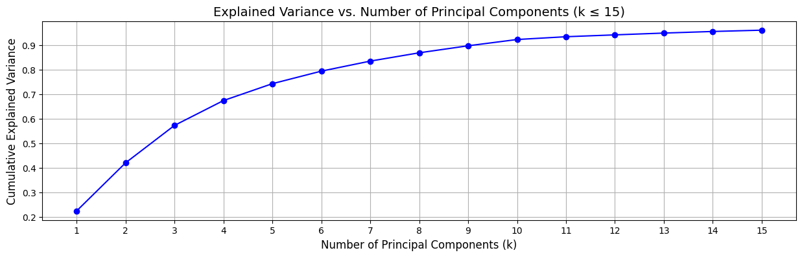

# MNIST(Task1)
- PCA and LDA analysis on MNIST dataset
- Implement an Auto-encoder network
- Clustering with K-means
- Clustering with GMM

## PCA and LDA Analysis on MNIST Dataset

| Method                          | Accuracy   |
|---------------------------------|------------|
| Original Data                   | 0.885      |
| Manual PCA                      | 0.865      |
| RBF Kernel PCA                  | 0.8175     |
| Polynomial Kernel PCA           | 0.825      |
| Linear Kernel PCA               | 0.865      |
| LDA Projected Data              | 0.755      |

## K-means Results

| K (Number of Clusters) | Dunn Index |
|------------------------|------------|
| 3                      | 0.363      |
| 4                      | 0.265      |
| 5                      | 0.460      |

# Cove data-set(Task2)

Some of tasks done in this section which is part of a MDA assignment:
- Using the PCA algorithm, choose the value of k in such a way that at least 90% of the variance of the samples is maintained
- Reduce the dimensions of the samples using the obtained eigenvectors.
<div style="text-align: center;">
    
</div>

- Divide the data(covtype.info) into three chunks and group the data into 7 clusters using one of the BRF or Cure algorithms.
<div style="text-align: center;">
    
</div>

- Evaluate using metrics *Silhouette Score* and *Davies-Bouldin Index*
```markdown
Silhouette Score: 0.42960626042271594
Davies-Bouldin Index: 4.129832832292689
```
